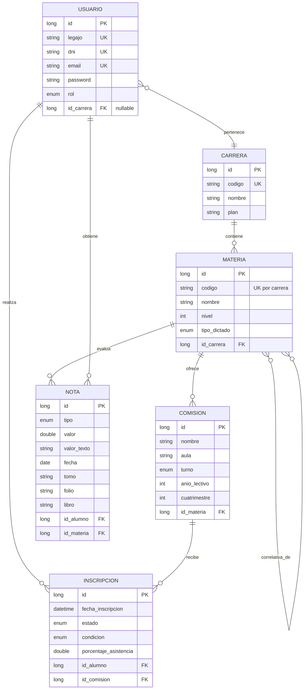

# Diagrama Entidad-Relación (DER) Refinado — SYSACAD API

Este diagrama ha sido diseñado tras una auditoría exhaustiva del sistema de autogestión actual de la UTN-MDP, capturando no solo la lógica de negocio sino también los atributos técnicos necesarios para un sistema académico real.

## 1. Entidades y Atributos

### 👤 Usuario (Alumno / Administrador)
Representa a los actores del sistema.
- **id** (Long, PK)
- **legajo** (String, Unique) — Ej: "611790"
- **dni** (String, Unique)
- **nombre** (String)
- **apellido** (String)
- **email** (String, Unique)
- **password** (String) — Encriptada con BCrypt.
- **rol** (Enum) — `ALUMNO`, `ADMIN`.
- **id_carrera** (Long, FK, Nullable) — Solo aplica para alumnos. Un administrador no tiene carrera asignada.

### 🎓 Carrera (Especialidad)
- **id** (Long, PK)
- **codigo** (String, Unique) — Ej: "ISI", "TUP".
- **nombre** (String) — Ej: "Ingeniería en Sistemas de Información".
- **plan_estudio** (String) — Ej: "Plan 2024".

### 📚 Materia
- **id** (Long, PK)
- **codigo** (String) — Ej: "101". Único dentro de una misma carrera (UK compuesta: codigo + id_carrera).
- **nombre** (String) — Ej: "Programación III".
- **nivel** (Integer) — Año de la carrera (1, 2, 3...).
- **carga_horaria** (Integer) — Horas totales.
- **tipo_dictado** (Enum) — `ANUAL`, `CUATRIMESTRAL_1`, `CUATRIMESTRAL_2`.
- **id_carrera** (Long, FK)

### 🏫 Comisión
Representa una oferta específica de una materia en un período lectivo determinado.
- **id** (Long, PK)
- **nombre** (String) — Ej: "Comisión 04TUP2".
- **aula** (String)
- **turno** (Enum) — `MAÑANA`, `TARDE`, `NOCHE`.
- **anio_lectivo** (Integer) — Ej: 2026.
- **cuatrimestre** (Integer) — 1 o 2.
- **id_materia** (Long, FK)

### 📝 Inscripción
Vínculo entre el Alumno y la Comisión/Materia.
- **id** (Long, PK)
- **id_alumno** (Long, FK)
- **id_comision** (Long, FK)
- **fecha_inscripcion** (LocalDateTime)
- **estado** (Enum) — `CURSANDO`, `APROBADA`, `DESAPROBADA`, `ABANDONO`. Indica la situación final de la cursada.
- **condicion** (Enum) — `REGULAR`, `LIBRE`. Se determina por reglas de negocio según asistencia y notas (porcentaje de asistencia >= 70% para regularidad).
- **porcentaje_asistencia** (Double) — Ej: 85.5. Calculado a partir del total de clases de la comisión.

### 🏆 Nota / Examen
Registro de calificaciones obtenidas.
- **id** (Long, PK)
- **id_alumno** (Long, FK)
- **id_materia** (Long, FK)
- **tipo** (Enum) — `PARCIAL_1`, `PARCIAL_2`, `RECUPERATORIO`, `FINAL`.
- **valor** (Double) — Nota numérica (0-10).
- **valor_texto** (String) — Ej: "OCHO", "AUSENTE".
- **fecha** (LocalDate)
- **tomo** (String) — Datos de acta física.
- **folio** (String)
- **libro** (String)

---

## 2. Relaciones y Cardinalidades

- **Usuario (N) : (1) Carrera**: Un alumno pertenece a una carrera. Un administrador no tiene carrera (FK nullable).
- **Carrera (1) : (N) Materia**: Una carrera contiene muchas materias.
- **Materia (1) : (N) Comisión**: Una materia puede tener múltiples comisiones (ej: Mañana y Noche, o en diferentes cuatrimestres/años).
- **Materia (N) : (M) Materia (Correlatividades)**: Una materia puede tener muchas correlativas y ser correlativa de muchas. Se resuelve con tabla intermedia `correlatividades`.
- **Alumno (1) : (N) Inscripción**: Un alumno se inscribe a muchas comisiones a lo largo de la carrera.
- **Comisión (1) : (N) Inscripción**: Una comisión tiene muchos alumnos inscriptos.
- **Alumno (1) : (N) Nota**: Un alumno tiene muchas notas.
- **Materia (1) : (N) Nota**: Una materia genera muchas notas para distintos alumnos.

---

## 3. Modelo Relacional

---

## 4. Restricciones y Reglas de Negocio Clave

| Regla | Descripción |
|-------|-------------|
| **R1 — Carrera nullable para Admin** | El campo `id_carrera` en `Usuario` solo es obligatorio para el rol `ALUMNO`. Un `ADMIN` no tiene carrera asignada. |
| **R2 — Código de materia único por carrera** | El par `(codigo, id_carrera)` es único. Permite que dos carreras distintas tengan una materia "101" sin colisionar. |
| **R3 — Condición de regularidad** | Un alumno es `REGULAR` si su `porcentaje_asistencia >= 70%` y tiene aprobados los parciales. De lo contrario es `LIBRE`. Esto es una regla de negocio calculada, no un estado arbitrario. |
| **R4 — Correlatividades** | No se puede inscribir a una comisión de una materia si el alumno no tiene aprobada (o regularizada) al menos una de sus correlativas. |
| **R5 — Periodo de comisión** | Una comisión pertenece a un año lectivo y cuatrimestre concretos. Evita que una inscripción de 2025 se mezcle con una de 2026. |
| **R6 — Acta de examen** | Las notas finales deben registrar `tomo`, `folio` y `libro` para homologación con el sistema de actas físicas de la facultad. |

## 5. Justificación para la Cátedra
Este modelo utiliza **6 entidades principales**, superando el mínimo de 5 para grupos de 5 integrantes (o 3 para grupos de 3). Incluye relaciones **1:N**, **N:M** y una **reflexiva** (correlatividades), cubriendo todos los tipos de cardinalidad requeridos.

La inclusión de `Comision` es vital para separar la **materia** (el catálogo del plan de estudios) de la **cursada** (la instancia concreta con turno, aula y docente en un período determinado). Esto permite:
- Ofrecer la misma materia en múltiples turnos simultáneamente.
- Mantener histórico de comisiones año tras año sin duplicar la materia.
- Controlar cupos y asignación de aulas de forma independiente.

Esta separación resuelve una de las principales limitaciones del **SYSACAD actual**, donde la materia y la cursada están fuertemente acopladas, dificultando la gestión de múltiples ofertas horarias.
