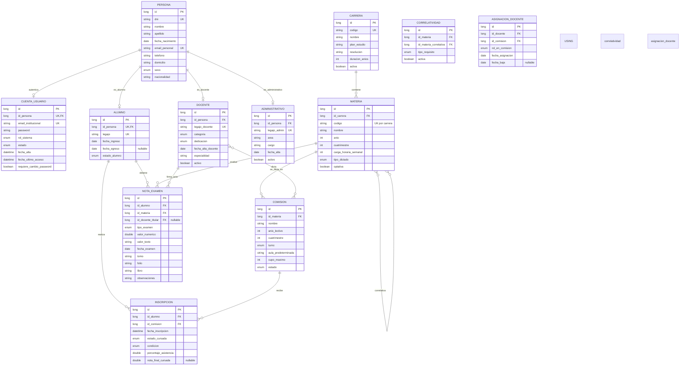

# Diagrama Entidad-Relación (DER) — SYSACAD Proyecto Real

Este modelo representa una arquitectura de datos de grado empresarial para un Sistema Académico de autogestión. A diferencia del modelo simplificado para el TP, aquí se separan explícitamente las identidades personales, las cuentas de acceso y los perfiles funcionales (alumno, docente, administrativo), permitiendo que una misma persona física tenga múltiples roles a lo largo de su vínculo con la institución sin duplicar datos.

---

## 1. Entidades y Atributos

### 👤 Persona
Entidad central de identidad. Almacena datos biográficos y de contacto. Es independiente del rol que la persona desempeñe en la institución.
- **id** (Long, PK)
- **dni** (String, UK) — Documento Nacional de Identidad.
- **nombre** (String)
- **apellido** (String)
- **fecha_nacimiento** (LocalDate)
- **email_personal** (String, UK)
- **telefono** (String)
- **domicilio** (String)
- **sexo** (Enum) — `MASCULINO`, `FEMENINO`, `OTRO`, `NO_BINARIO`.
- **nacionalidad** (String)

---

### 🔐 CuentaUsuario
Gestiona la autenticación y autorización en el sistema. Desacopla la identidad (Persona) del mecanismo de acceso. Una persona puede tener una o más cuentas (aunque lo habitual es una única cuenta institucional).
- **id** (Long, PK)
- **id_persona** (Long, UK, FK) — Vinculación 1:1 con Persona.
- **email_institucional** (String, UK) — Ej: `611790@utn.edu.ar`.
- **password** (String) — Hash seguro (Argon2 / BCrypt).
- **rol_sistema** (Enum) — `ALUMNO`, `DOCENTE`, `ADMINISTRATIVO`, `SYSADMIN`.
- **estado** (Enum) — `ACTIVA`, `BLOQUEADA`, `EXPIRADA`, `ELIMINADA`.
- **fecha_alta** (LocalDateTime)
- **fecha_ultimo_acceso** (LocalDateTime)
- **requiere_cambio_password** (Boolean) — Forzar cambio en primer login.

---

### 🎓 Alumno
Perfil académico de una persona que cursa una o más carreras. Una misma Persona puede tener un perfil de Alumno y, más adelante, un perfil de Docente (datos históricos independientes).
- **id** (Long, PK)
- **id_persona** (Long, UK, FK) — Una persona = un perfil de alumno (en el mismo período).
- **legajo** (String, UK) — Ej: "611790".
- **fecha_ingreso** (LocalDate)
- **fecha_egreso** (LocalDate, Nullable)
- **estado_alumno** (Enum) — `ACTIVO`, `EGRESADO`, `BAJA_TEMPORARIA`, `BAJA_DEFINITIVA`.

---

### 👨‍🏫 Docente
Perfil profesional del personal docente. Incluye información laboral y categorización universitaria.
- **id** (Long, PK)
- **id_persona** (Long, FK) — Una persona puede ser docente en múltiples períodos, pero el perfil es único.
- **legajo_docente** (String, UK)
- **categoria** (Enum) — `AYUDANTE_ALUMNO`, `AYUDANTE_DIPLOMADO`, `JTP`, `ADJUNTO`, `ASOCIADO`, `TITULAR`.
- **dedicacion** (Enum) — `SIMPLE`, `EXCLUSIVA`, `SEMI_EXCLUSIVA`.
- **fecha_alta_docente** (LocalDate)
- **especialidad** (String)
- **activo** (Boolean)

---

### 🏢 Administrativo
Perfil del personal no docente que gestiona trámites y operaciones del sistema.
- **id** (Long, PK)
- **id_persona** (Long, FK)
- **legajo_admin** (String, UK)
- **area** (String) — Ej: "Secretaría Académica", "Tesorería", "Dirección".
- **cargo** (String) — Ej: "Secretario", "Bedel", "Director de Carrera".
- **fecha_alta** (LocalDate)
- **activo** (Boolean)

---

### 🎓 Carrera
- **id** (Long, PK)
- **codigo** (String, UK) — Ej: "ISI", "TUP", "IQ".
- **nombre** (String)
- **plan_estudio** (String) — Ej: "Plan 2024", "Plan 2008".
- **resolucion** (String) — Número de resolución ministerial que aprueba la carrera.
- **duracion_anios** (Integer)
- **activa** (Boolean)

---

### 📚 Materia
Unidad curricular perteneciente a un plan de estudios de una carrera.
- **id** (Long, PK)
- **id_carrera** (Long, FK)
- **codigo** (String) — Ej: "PROG3". UK compuesta: `(codigo, id_carrera)`.
- **nombre** (String)
- **anio** (Integer) — Año en el plan de estudios.
- **cuatrimestre** (Integer) — 1, 2, o 0 si es anual.
- **carga_horaria_semanal** (Integer)
- **tipo_dictado** (Enum) — `ANUAL`, `CUATRIMESTRAL`.
- **optativa** (Boolean) — Indica si es obligatoria u optativa.

---

### 🏫 Comision
Oferta concreta de una materia dictada en un período lectivo específico. Es la instancia real a la que el alumno se inscribe.
- **id** (Long, PK)
- **id_materia** (Long, FK)
- **nombre** (String) — Ej: "Comisión A", "Comisión 1TUP".
- **anio_lectivo** (Integer)
- **cuatrimestre** (Integer)
- **turno** (Enum) — `MAÑANA`, `TARDE`, `NOCHE`.
- **aula_predeterminada** (String)
- **cupo_maximo** (Integer)
- **estado** (Enum) — `PLANIFICADA`, `ABIERTA_INSCRIPCION`, `EN_CURSO`, `CERRADA`.

---

### 📝 Inscripcion
Vínculo entre un Alumno y una Comisión en la que se ha inscripto.
- **id** (Long, PK)
- **id_alumno** (Long, FK)
- **id_comision** (Long, FK)
- **fecha_inscripcion** (LocalDateTime)
- **estado_cursada** (Enum) — `CURSANDO`, `APROBADA`, `DESAPROBADA`, `ABANDONO`.
- **condicion** (Enum) — `REGULAR`, `LIBRE`. Determinada por asistencia y notas.
- **porcentaje_asistencia** (Double)
- **nota_final_cursada** (Double, Nullable)

---

### 🏆 NotaExamen
Registro oficial de evaluaciones rendidas por un alumno en una materia. Incluye metadatos de acta para trazabilidad legal.
- **id** (Long, PK)
- **id_alumno** (Long, FK)
- **id_materia** (Long, FK)
- **id_docente_titular** (Long, FK, Nullable) — Docente que firmó el acta.
- **tipo_examen** (Enum) — `PARCIAL_1`, `PARCIAL_2`, `RECUPERATORIO`, `FINAL`, `EQUIVALENCIA`.
- **valor_numerico** (Double)
- **valor_texto** (String) — Ej: "OCHO", "AUSENTE", "NO_APROBADO".
- **fecha_examen** (LocalDate)
- **tomo** (String)
- **folio** (String)
- **libro** (String)
- **observaciones** (String, Nullable)

---

### 🔗 Correlatividad (Entidad Asociativa)
Tabla intermedia que modela las dependencias académicas entre materias.
- **id** (Long, PK)
- **id_materia** (Long, FK) — Materia que tiene la correlativa.
- **id_materia_correlativa** (Long, FK) — Materia que debe estar aprobada.
- **tipo_requisito** (Enum) — `APROBADA`, `REGULARIZADA`. Si debe estar aprobada o alcanza con regular.
- **activa** (Boolean)

---

### 👨‍🏫 AsignacionDocente
Vínculo entre un Docente y una Comisión que dicta. Permite que una comisión tenga un titular y varios ayudantes (1:N desde Comisión, o N:M si un docente puede estar en muchas comisiones, lo cual es real).
- **id** (Long, PK)
- **id_docente** (Long, FK)
- **id_comision** (Long, FK)
- **rol_en_comision** (Enum) — `TITULAR`, `AYUDANTE_PRIMERA`, `AYUDANTE_SEGUNDA`, `JTP`.
- **fecha_asignacion** (LocalDate)
- **fecha_baja** (LocalDate, Nullable)

---

## 2. Relaciones y Cardinalidades

| Entidad A | Cardinalidad | Entidad B | Descripción |
|-----------|--------------|-----------|-------------|
| Persona | **1 : 1** | CuentaUsuario | Una persona tiene una única cuenta institucional principal. |
| Persona | **1 : 1** | Alumno | Un perfil de alumno por persona (histórico único). |
| Persona | **1 : 1** | Docente | Un perfil de docente por persona. |
| Persona | **1 : 1** | Administrativo | Un perfil administrativo por persona. |
| Carrera | **1 : N** | Materia | Una carrera tiene muchas materias en su plan. |
| Materia | **1 : N** | Comision | Una materia se dicta en muchas comisiones (diferentes años, turnos). |
| Materia | **N : M** | Materia (Correlatividad) | Una materia depende de muchas correlativas y es correlativa de muchas. |
| Alumno | **1 : N** | Inscripcion | Un alumno se inscribe a muchas comisiones a lo largo de la carrera. |
| Comision | **1 : N** | Inscripcion | Una comisión recibe muchos alumnos inscriptos. |
| Alumno | **1 : N** | NotaExamen | Un alumno acumula muchas notas/exámenes. |
| Materia | **1 : N** | NotaExamen | Una materia genera muchas notas para distintos alumnos. |
| Docente | **1 : N** | NotaExamen | Un docente puede firmar actas de examen. |
| Docente | **N : M** | Comision (AsignacionDocente) | Un docente puede dictar varias comisiones (aunque sea en diferentes cuatrimestres). Una comisión puede tener varios docentes (titular + ayudantes). |

---

## 3. Modelo Relacional (Diagrama Mermaid)

---

## 4. Principios de Diseño Aplicados

### 4.1 Separación de Identidad, Autenticación y Autorización
- **Persona** es la identidad legal/biográfica. No tiene contraseña ni rol.
- **CuentaUsuario** es la credencial digital. Permite deshabilitar una cuenta sin borrar a la persona.
- Esto permite que una persona recupere su cuenta, cambie su email institucional o tenga una cuenta temporal de invitado sin afectar su identidad.

### 4.2 Especialización de Roles (Alumno, Docente, Administrativo)
- Cada perfil funcional es una entidad independiente vinculada a Persona 1:1.
- **Ventaja:** Una persona puede ser alumno en 2020, egresar en 2025, y convertirse en docente en 2026. Sus datos históricos de alumno se preservan intactos mientras se crea un nuevo perfil de docente.
- **Ventaja:** Un docente que también es alumno de posgrado puede tener ambos perfiles activos simultáneamente sin conflictos de legajo ni permisos.

### 4.3 Independencia del Período Lectivo
- **Materia** es un catálogo abstracto (el "qué").
- **Comisión** es una instancia concreta en el tiempo (el "cómo", "cuándo" y "dónde").
- Esto permite reutilizar la materia año tras año, manteniendo historial de comisiones pasadas con sus docentes, alumnos y aulas.

### 4.4 Traza de Actas y Firmas
- `NotaExamen` vincula no solo al alumno y la materia, sino también al **docente titular** que firmó el acta (`id_docente_titular`).
- Los campos `tomo`, `folio`, `libro` permiten la homologación con el sistema de registros físicos de la universidad, requisito legal en instituciones públicas argentinas.

### 4.5 Flexibilidad Docente
- `AsignacionDocente` es N:M, no 1:N. Una comisión puede tener un titular + ayudantes. Un docente puede estar en varias comisiones (aunque sea en diferentes períodos).
- El campo `rol_en_comision` permite distinguir responsabilidades dentro de la misma comisión.

---

## 5. Comparativa con el Modelo TP

| Aspecto | Modelo TP (Simplificado) | Modelo Proyecto Real |
|---------|--------------------------|----------------------|
| **Identidad** | `Usuario` unificado con rol. | `Persona` + `CuentaUsuario` desacoplados. |
| **Roles** | Enum dentro de Usuario. | Entidades independientes: `Alumno`, `Docente`, `Administrativo`. |
| **Docente** | No existe como entidad. | Entidad completa con categoría, dedicación y asignaciones. |
| **Autenticación** | Legajo como username. | Email institucional + hash seguro + control de estado de cuenta. |
| **Materia vs Comisión** | Comisión existe pero es básica. | Comisión es robusta: cupos, estados del ciclo de vida, aula, turno. |
| **Notas** | Sin vínculo al docente que firmó. | Vinculada al `Docente` titular y con metadatos de acta. |
| **Correlatividades** | N:M simple. | N:M con tipo de requisito (`APROBADA` vs `REGULARIZADA`). |
| **Históricos** | Un alumno es un usuario. | Una `Persona` puede tener múltiples perfiles a lo largo del tiempo. |

---

## 6. Notas para Escalabilidad Futura

Si este modelo se implementara en producción, las siguientes entidades se agregarían en iteraciones posteriores sin romper el modelo base:
- **Aula**: Entidad propia con edificio, piso, capacidad, recursos (proyector, laboratorio).
- **Horario**: Desdoblar el turno en bloques horarios específicos (Lunes 18:00-22:00).
- **Pago / Cuota**: Integración con el módulo de tesorería.
- **Trámite / Solicitud**: Excepciones de correlatividad, equivalencias, certificados.
- **Mensajería / Notificación**: Comunicaciones entre alumno y secretaría.
- **Log de Auditoría**: Tabla immutable que registra quién modificó una nota y cuándo (crítico para datos sensibles).
